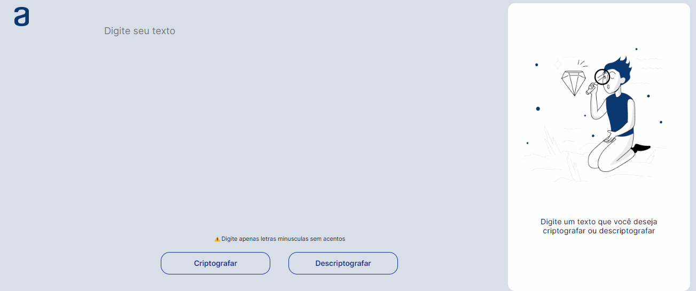

# Secret Message

Aplicação web simples para criptografar e descriptografar mensagens secretas usando um método de substituição de letras.

## Funcionalidades

- Criptografar texto digitado substituindo letras específicas por outras.
- Descriptografar texto criptografado e restaurar as letras originais.
- Copiar o texto criptografado ou descriptografado para a área de transferência.

## Como Usar

1. Clone o repositório:

2. Abra o arquivo `index.html` no seu navegador.

3. Digite o texto que deseja criptografar ou descriptografar na área de texto.

4. Clique no botão "Criptografar" ou "Descriptografar" para ver o resultado na área de resultado.

5. Se desejar, clique no botão "Copiar" para copiar o resultado para a área de transferência.

## Tecnologias Utilizadas

- HTML
- CSS
- JavaScript

## Autor

- Bianca Bezerra
